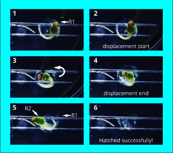
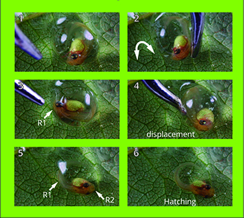
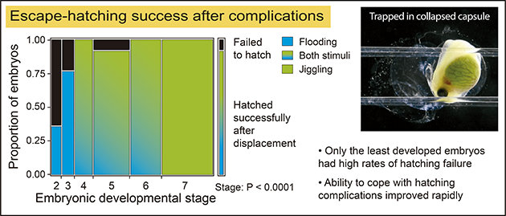
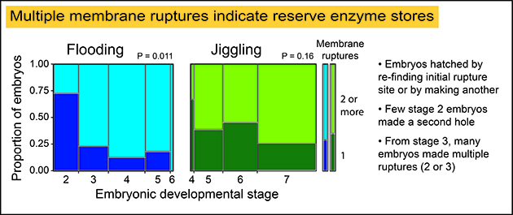
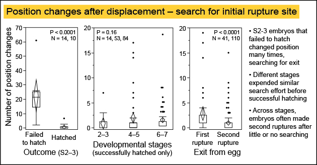
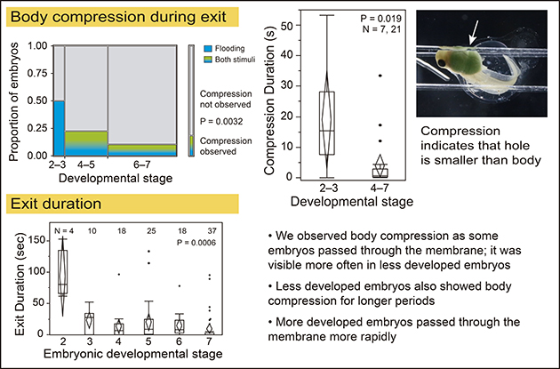

***
# **Development of hatching ability in red-eyed treefrogs: escape from complications** 
***

Authors: MJ Salazar-Nicholls^1,3^, KD Escobar^2^ & KM Warkentin^3^

Affiliations: 1. Pontificia Universidad Católica, Ecuador; 2. Western Connecticut State University; 3. Boston  University – majonicholls2909@gmail.com – [Warkentin Lab](http://sites.bu.edu/warkentinlab/)


## **Brief Introduction**

Hatching early allows embryos to escape threats to eggs, but increases risks to larvae. Red-eyed treefrogs hatch by rapidly releasing enzymes to digest a small hole in their membrane, then squeezing out aided by turgor pressure. Displacement from the initial hole can occur spontaneously and in predator attacks, complicating hatching by capsular collapse as fluid escapes. To assess developmental changes in ability to recover from such complications, we manually displaced 3-5 day old embryos during hatching, interrupting exit through their initial hole, and recorded macro-video. To induce hatching of younger, vibration-insensitive embryos, we submerged individual eggs in hypoxic water. For older embryos, we used a blunt probe to jiggle eggs within clutches. Once an embryo began hatching, we manually displaced it, moving its snout away from the forming or just-formed hole. We analyzed videos to assess if and how embryos escaped. The least-developed embryos rarely escaped from collapsed capsules but performance improved rapidly; late stages always escaped. Embryos escaped by either re-finding their first hole or making a second. The post-displacement delay to start an exit through the first hole was similar across stages. Even at the earliest stages, a few individuals made second holes, but the likelihood of doing so increased rapidly, to about 75%. More developed embryos spent less effort searching for their first hole; they made second holes sooner and more efficiently. They also passed through the membrane more rapidly, with less body compression in transit. Along with high risk after hatching, poor ability to escape from hatching complications may select against unnecessary hatching attempts at early developmental stages.


### **Objective** 
Assess developmental changes in ability to recover from hatching complications in Red-eyed treefrogs embryos


## **Methods**

* Collected young *A. callidryas* clutches from pond, maintained in lab at Smithsonian Tropical Research Institute, Gamboa, Panama
* Induced individual 3– 5 day old embryos to begin hatching, using hypoxia and mechanosensory stimuli
* Manually displaced embryo in egg, interrupting exit through initial rupture
* Recorded macro-video until embryo exited its capsule; rescued individuals that failed to hatch after 30 minutes
* Video analysis: We analyzed recordings in QuickTime Player (Apple Inc), event timing was quantified from frame numbers. Quantified events were first membrane rupture time, position changes after displacement, second rupture time, body compression observed during exit, compression duration time, exit duration as defined in Cohen et al (2016). 

Flooding | Jiggling
------------- | -------------
we submerged younger eggs in hypoxic water (N = 25, 27 at ages 3 and 4 d) | we used a blunt probe to move older eggs on clutches (N = 64, 51 at ages 4 and 5 d)
 |

R1: rupture one

R2: rupture two

## **Outline** 

This is an analysis of the data used for a poster presentation at SICB 2017, which now is part of a manuscript. The statistical analyses presented in the poster were made using [JMP-data analysis sorfware](https://www.jmp.com/en_us/software/data-analysis-software.html)
The statistical analysis in made for SICB includes: boxplots, contingency Analysis (Mosaic plots and contingency tables), Wilcoxon/Kruskal-Wallis (Rank Sum) tests, Fisher´s exact Test,

(1) Load and data preparation
(2) Exporatory analysis
(3) Results

   + 3.1. Escape-hatching success after complications: compare the hatching success of embryos after displacement across different developmental stages

            * Mosaic plots, contingency analysis

            * Pearson's Chi-squared test

   + 3.2. Multiple membrane ruptures: analyzed the ability to make more membrane ruptures after displacement across different developmental stages, comparison between treatments

            * Mosaic plots, contingency analysis
            * Wilcoxon test

   + 3.3. Position changes after displacement – search for initial rupture site: compare the behavior (body positions changes) after the embryo lost the first rupture. How many times the embryos -across different developmental stages- move around the egg before making another hole or until the time when need to be rescued

            * Box plots
            * Wilcoxon test

   + 3.4. Body compression during exit: compare body compression observation and duration across different developmental stages

            * Mosaic plots, contingency analysis
            * Box plots
            * Wilcoxon test

   + 3.5. Exit duration: compare the speed of the hatching process (after displacement) across different developmental stages 

            * Box plots
            * Wilcoxon test

(4) Figure
(5) Conclusions
(6) References

### Packages required

* curl
* dplyr
* ggplot2
* plotly
* EnvStats
* MASS
* coin
* vcd
* vcdExtra


### Loading required libraries
```{r, include=FALSE}
library(knitr)
library(curl)
library(dplyr)
library(ggplot2)
library(plotly)
library(EnvStats)
library(MASS)
library(coin)
library(vcd)
library(vcdExtra)
```

## **1. Load and data preparation**

### **1.1 Data loading**

```{r}
f <- curl("https://raw.githubusercontent.com/mjsalnic/mjsalnic-data-replication-assignment/master/HC2016R.csv")
HC2016R <- read.csv(f, header = TRUE, sep = ";",dec=",", stringsAsFactors = FALSE)
kable(head(HC2016R))

```

```{r,include=FALSE}
attach(HC2016R)
```

### **1.2 Preparing the data frame to analysis**

* Transforming numerical variables to factorial 

```{r}
HC2016R$Stage<- factor(HC2016R$Stage)
HC2016R$Age<- factor(HC2016R$Age)
HC2016R$NumHoles<- factor(HC2016R$NumHoles)
HC2016R$Rescue<- factor(HC2016R$Rescue)

str(HC2016R)
```

* Subsetting data frame

let’s subset the data into 2 outcome groups: success_hat (hatched embryos after displacement) and failed_hat(embryos unable to hatch after displacement) 
```{r}
success_hat<-subset(HC2016R, Rescue==0, na.rm=T)
failed_hat<-subset(HC2016R, Rescue==1, na.rm=T)
```

let’s subset the data into 2 treatment groups: flooding and jiggling
```{r}
flooding<-subset (HC2016R, Treatment=="Flooding", na.rm=T)
jiggling<-subset(HC2016R, Treatment=="Jiggling", na.rm=T)
```


## **2. Exploratory analysis**

Compare number of holes by Age
```{r}
mosaic(~ NumHoles + Age, data = HC2016R, main = "Escape-hatching success after complications", shade= TRUE,legend=TRUE)
```

compare number of holes by Stage

```{r}
mosaic(~ NumHoles + Stage, data = HC2016R, main = "Escape-hatching success after complications", shade= TRUE,legend=TRUE)
```


Should we use parametric or non-parametric test?

```{r}
par(mfrow=c(3,2))
hist(HC2016R$NumPosChanADBefore2ndHole[HC2016R$Stage=="2"])
hist(HC2016R$NumPosChanADBefore2ndHole[HC2016R$Stage=="3"])
hist(HC2016R$NumPosChanADBefore2ndHole[HC2016R$Stage=="4"])
hist(HC2016R$NumPosChanADBefore2ndHole[HC2016R$Stage=="5"])
hist(HC2016R$NumPosChanADBefore2ndHole[HC2016R$Stage=="6"])
hist(HC2016R$NumPosChanADBefore2ndHole[HC2016R$Stage=="7"])

```


There are not differences between treatments

## **3. Results**

### **3.1 Escape-hatching success after complications**

Original Data: 




### 3.1.1 Mosaic plot - graphical representation of the frequency of successul hatching and unable to hatch after displacement experiment (combined experiments)


```{r}
mosaic(~ Rescue + Stage, data = HC2016R, main = "Escape-hatching success after complications", shade= TRUE,legend=TRUE)
```


```{r}
totals=table(HC2016R$Stage,HC2016R$Rescue)
mosaicplot(totals, main = "Escape-hatching success after complications", xlab = "Embryonic developmental stage", ylab = "proportion of embryos", col=c("light green", "black"))

#where 0 means no rescue needed, embryo able to hatch by itself and 1 means rescue after displacement experiment 

```


      * 1= Failed to hatch 

      * 0= Succesfully hatched embryos 

      * Original JMP: P < 0.0001
      * Replication: P < 0.0001


2. Contingency table-  Escape-hatching success after complications
```{r}

tab1<-table(HC2016R$Stage, HC2016R$Rescue)
prop.table(tab1)*100
chisq.test(tab1)
fisher.test(tab1)

```
### **3.2 Multiple membrane ruptures**


Original Data




**1. Treatments together**
```{r}
tab<-table(HC2016R$Stage, HC2016R$NumHoles)
prop.table(tab)*100
chisq.test(tab)
fisher.test(tab)
```

#### **By treatment**

**2. Flooding treatment**- Mosaic plot- multiple membrane ruptures 

```{r,include=FALSE}
attach(flooding)
```


```{r}

totals=table(flooding$Stage,flooding$NumHoles)
mosaicplot(totals, main = "Multiple membrane ruptures", xlab = "Embryonic developmental stage", ylab = "Proportion of embryos", col=c("light green", "black"))
```
 


Compare number of holes by stage- Flooding treatment
```{r}
mosaic(~ NumHoles + Stage, data = flooding, main = "Escape-hatching success after complications", shade= TRUE,legend=TRUE)
```
    
      * Original JMP: p-value = 0.011
      * Replication: p-value = 0.018
      
      
**2.1 Flooding treatment**- Contigency table
```{r}
tab2<-table(flooding$Stage, flooding$NumHoles)
tab2
```

**3. Jiggling treatment- Mosaic plot** 
```{r}
totals=table(jiggling$Stage,jiggling$NumHoles)
mosaicplot(totals, main = "Multiple membrane ruptures", xlab = "Embryonic developmental stage", ylab = "Proportion of embryos", col=c("light green", "black"))


```

    
  

**3.1 Jiggling treatment**- Contigency table
```{r}
tab3<-table(jiggling$Stage, jiggling$NumHoles)
fisher.test(tab3)
summary(tab3)
```


      * Original JMP: p-value= 0.16
      * Replication: p-value = 0.1508
      
      
### **3.3 Position changes after displacement – search for initial rupture site**

Original Data


```{r}
par(mfrow=c(1,2))
boxplot(NumPosChanADBefore2ndHole~Stage,success_hat)

boxplot(NumPosChanADBefore2ndHole~Stage,failed_hat)
```

Subsetting data frame: to extract only values from the earliest stages where embryos got more trouble making a second hole to hatch

```{r}
young_outcome<- subset(HC2016R, comst="2-3", select = NumPosChanADBefore2ndHole:Rescue)

str(young_outcome)
```
```{r}
par(mfrow=c(1,2))
hist(young_outcome$NumPosChanADBefore2ndHole[young_outcome$Rescue=="1"])
hist(young_outcome$NumPosChanADBefore2ndHole[young_outcome$Rescue=="0"])

```


```{r}
boxplot(data = young_outcome, NumPosChanADBefore2ndHole ~ Rescue, col = c("burlywood2", 
    "lightpink1"))

wilcox.test(NumPosChanADBefore2ndHole~Rescue, data = young_outcome, correct=FALSE)
```

p-value = < 0.0001
N= 10,14

```{r}
boxplot(data = success_hat, NumPosChanADBefore2ndHole ~ comst, col = c("burlywood2", 
    "lightpink1", "purple"))

kruskal.test(NumPosChanADBefore2ndHole ~ comst,
             data =success_hat)
```

 p-value = 0.2488
 N = 14, 53, 84

Exit from egg: fist or second rupture

```{r}
boxplot(data = success_hat, NumPosChanADBefore2ndHole ~ NumHoles, col = c("burlywood2", 
    "lightpink1"))

wilcox.test(NumPosChanADBefore2ndHole~NumHoles, data = success_hat, correct=FALSE)
```
P < 0.0001
N = 41, 110


### **3.4 Body compression during exit: compare body compression observation and duration across different developmental stages**



*Mosaic plot - compression seen across stages
```{r}
totals1=table(success_hat$comst,success_hat$CompressionSeen)
mosaicplot(totals1, main = "Escape-hatching success after complications", xlab = "Embryonic developmental stage", ylab = "proportion of embryos", col=c("light green", "pink"))
```


```{r, include=FALSE}
attach(success_hat)
```


```{r}
mosaic(~ CompressionSeen + comst, data = success_hat, main = "Escape-hatching success after complications", shade= TRUE,legend=TRUE)
```

```{r}
fisher.test(totals1)
```


* Boxplot compression duration in seconds

```{r}
p <- ggplot(data=success_hat, aes(x=groupst, y= CompressionSec, fill=groupst))+stat_boxplot(geom='errorbar', linetype=1, width=0.5)+  #whiskers
geom_boxplot(outlier.shape=1)
p <- p + geom_boxplot()+ stat_summary(fun.y = mean, geom = "point", shape=5, size=5, fill="white")
p <- p + theme(axis.text.x=element_text(angle=0))
p <- p + ylab("Compression Duration (sec)") + xlab("Developmental stage")
p <- p + stat_n_text(y.pos = 70)
p <- p + theme_classic()+ scale_fill_manual(breaks = c("2,3", "4,7"), 
                       values=c("lightskyblue", "mediumaquamarine"))
p
```


* Compression duration (s)
```{r}
boxplot(CompressionSec ~ groupst, data=success_hat)
```

p-value = 0.02087


```{r}
wilcox.test(CompressionSec ~groupst, data=success_hat)

```
        

### **3.5. Exit duration: compare the speed of the hatching process (after displacement) across different developmental stages** 

* Boxplot exit duration in seconds
```{r}
#good one
attach(success_hat)
#good one
p <- ggplot(data=success_hat, aes(x=Stage, y=EXIT.DURATION.StarttoFullyOutsec, fill=Stage))+stat_boxplot(geom='errorbar', linetype=1, width=0.5)+  #whiskers
geom_boxplot(outlier.shape=1)
p <- p + geom_boxplot()+ stat_summary(fun.y = mean, geom = "point", shape=5, size=5, fill="white")
p <- p + theme(axis.text.x=element_text(angle=0))
p <- p + ylab("Exit duration (sec)")
p <- p + stat_n_text(y.pos = 170)
p <- p + theme_classic()+ scale_fill_manual(breaks = c("2", "3", "4", "5", "6", "7"), 
                       values=c("lightskyblue", "lightskyblue", "mediumaquamarine","mediumturquoise" ,"mediumturquoise","olivedrab2"))
p

```


## **5. Conclusions**
* Embryos escaped either by re-finding their first hole or by making another. Few Stage-2
embryos made a second hole but the likelihood of doing so increased rapidly.
* Many Stage 2 embryos changed position many times, presumably in effort to re-find their first
hole. More developed embryos also searched, but others immediately made another hole.
* Body compression during exit decreased with development; later stages made larger
holes and passed through them more rapidly, likely due to both increased ennzyme
reserves and greater muscular strength.

## **6. References**

1.Salazar-Nicholls, M.J., K.D. Escobar & K.M. Warkentin. January 2017. Development of hatching ability in red-eyed treefrogs: escape from complications. Society for Integrative and Comparative Biology Meeting, New Orleans, LA.
2. Cohen, K. L., Seid, M. A., & Warkentin, K. M. (2016). How embryos escape from danger: the mechanism of rapid, plastic hatching in red-eyed treefrogs. Journal of Experimental Biology, 219(12), 1875-1883.

```{r setup, include=FALSE}
knitr::opts_chunk$set(echo = TRUE)
```

## R Markdown

This is an R Markdown document. Markdown is a simple formatting syntax for authoring HTML, PDF, and MS Word documents. For more details on using R Markdown see <http://rmarkdown.rstudio.com>.

When you click the **Knit** button a document will be generated that includes both content as well as the output of any embedded R code chunks within the document. You can embed an R code chunk like this:

```{r cars}
summary(cars)
```

## Including Plots

You can also embed plots, for example:

```{r pressure, echo=FALSE}
plot(pressure)
```

Note that the `echo = FALSE` parameter was added to the code chunk to prevent printing of the R code that generated the plot.
