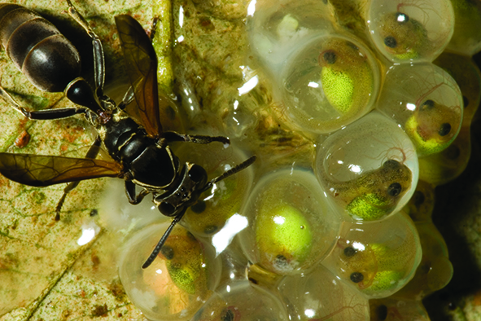

```{r setup, include=FALSE}
knitr::opts_chunk$set(echo = TRUE)
```

# **Development of hatching ability in red-eyed treefrogs: escape from complications**

Authors: MJ Salazar-Nicholls^1,3^, KD Escobar^2^ & KM Warkentin^3^
 1. Pontificia Universidad Católica, Ecuador; 2. Western Connecticut State University; 3. Boston Affiliations: University – majonicholls2909@gmail.com – [Warkentin Lab](http://sites.bu.edu/warkentinlab/)





## Brief Introduction

Hatching early allows embryos to escape threats to eggs, but increases risks to larvae. Red-eyed treefrogs, *Agalychnis callidryas*, hatch by rapidly releasing enzymes to digest a small hole in their
membrane, then squeezing out aided by turgor pressure. Displacement from the initial hole can occur spontaneously and in predator attacks, complicating hatching by capsular collapse as fluid escapes.

### Objective 
Assess developmental changes in ability to recover from hatching complications


## Methods

* Collected young *A. callidryas clutches from pond, maintained in lab at Smithsonian Tropical Research Institute, Gamboa, Panama
* Induced individual 3– 5 day old embryos to begin hatching, using hypoxia and mechanosensory stimuli
* Manually displaced embryo in egg, interrupting exit through initial rupture
* Recorded macro-video until embryo exited its capsule; rescued individuals that failed to hatch after 30 minutes
* Analyzed only videos where manipulation was performed successfully

Flooding | Jiggling
------------- | -------------
we submerged younger eggs in hypoxic water (N = 25, 27 at ages 3 and 4 d) | we used a blunt probe to move older eggs on clutches (N = 64, 51 at ages 4 and 5 d)
 |

R1: rupture one

R2: rupture two

## Outline 

This is an analysis of the data used for a poster presentation at SICB 2017, which now is part of a manuscript. The statistical analyses presented in the poster were made using [JMP-data analysis sorfware](https://www.jmp.com/en_us/software/data-analysis-software.html)

1. Load and data cleaning
2. Mosaic plots, contingency analysis
3. Wilcoxon test
4. Box plots


```{r}
#install.packages("MASS")
#install.packages("coin")
```

### Loading required libraries
```{r}
library(curl)
library(dplyr)
library(ggplot2)
library(plotly)
library(EnvStats)
library(MASS)
library(coin)
```


### Data loading

```{r}
f <- curl("https://raw.githubusercontent.com/mjsalnic/mjsalnic-data-replication-assignment/master/HC2016R.csv")
HC2016R <- read.csv(f, header = TRUE, sep = ";",dec=",", stringsAsFactors = FALSE)
head(HC2016R)

```

```{r}
attach(HC2016R)
```

Transforming numerical variables to factorial
### Exit duration
```{r}
HC2016R$Stage<- factor(HC2016R$Stage)
HC2016R$Age<- factor(HC2016R$Age)
HC2016R$NumHoles<- factor(HC2016R$NumHoles)
HC2016R$Rescue<- factor(HC2016R$Rescue)

str(HC2016R)
```

let’s subset the data into 2 outcome groups: success_hat (hatched embryos after displacement) and failed_hat(embryos unable to hatch after displacement) 
```{r}
success_hat<-subset(HC2016R, Rescue==0, na.rm=T)
failed_hat<-subset(HC2016R, Rescue==1, na.rm=T)
```

let’s subset the data into 2 treatment groups: flooding and jiggling
```{r}
flooding<-subset (HC2016R, Treatment=="Flooding", na.rm=T)
jiggling<-subset(HC2016R, Treatment=="Jiggling", na.rm=T)
```
Explore if there are differences in the outcome between treatments
## Results

### Escape-hatching success after complications
There are not differences between treatments

1. Mosaic plot - graphical representation of the frequency of successul hatching and unable to hatch after displacement experiment (combined experiments)

```{r}
totals=table(HC2016R$Stage,HC2016R$Rescue)
mosaicplot(totals, main = "Escape-hatching success after complications", xlab = "Embryonic developmental stage", ylab = "proportion of embryos", col=c("light green", "black"))

#where 0 means no rescue needed, embryo able to hatch by itself and 1 means rescue after displacement experiment 

```


1= Failed to hatch 

0= Succesfully hatched embryos 


Stage: P < 0.0001

2. Contingency table-  Escape-hatching success after complications
```{r}

tab1<-table(HC2016R$Stage, HC2016R$Rescue)
prop.table(tab1)*100
chisq.test(tab1)
fisher.test(tab1)

```
### Multiple membrane ruptures

1. Treatments together
```{r}
tab<-table(HC2016R$Stage, HC2016R$NumHoles)
prop.table(tab)*100
chisq.test(tab)
fisher.test(tab)
```


2. Mosaic plot- multiple membrane ruptures - Flooding treatment
```{r}
attach(flooding)
totals=table(flooding$Stage,flooding$NumHoles)
mosaicplot(totals, main = "Multiple membrane ruptures", xlab = "Embryonic developmental stage", ylab = "Proportion of embryos", col=c("light green", "black"))
```
p-value = 0.009272


2.1 Contigency table- Multiple membrane ruptures
```{r}
tab2<-table(flooding$Stage, flooding$NumHoles)
fisher.test(tab2)
```

3. Mosaic plot- multiple membrane ruptures - Jiggling treatment
```{r}
totals=table(jiggling$Stage,jiggling$NumHoles)
mosaicplot(totals, main = "Multiple membrane ruptures", xlab = "Embryonic developmental stage", ylab = "Proportion of embryos", col=c("light green", "black"))


```
p-value = 0.1508


3.1 Contigency table- Multiple membrane ruptures
```{r}
tab3<-table(jiggling$Stage, jiggling$NumHoles)
fisher.test(tab3)
summary(tab3)
```

### Position changes after displacement – search for initial rupture site

Should we use parametric or non-parametric test?

```{r}
par(mfrow=c(3,2))
hist(HC2016R$NumPosChanADBefore2ndHole[HC2016R$Stage=="2"])
hist(HC2016R$NumPosChanADBefore2ndHole[HC2016R$Stage=="3"])
hist(HC2016R$NumPosChanADBefore2ndHole[HC2016R$Stage=="4"])
hist(HC2016R$NumPosChanADBefore2ndHole[HC2016R$Stage=="5"])
hist(HC2016R$NumPosChanADBefore2ndHole[HC2016R$Stage=="6"])
hist(HC2016R$NumPosChanADBefore2ndHole[HC2016R$Stage=="7"])

```


```{r}
par(mfrow=c(1,2))
boxplot(NumPosChanADBefore2ndHole~Stage,success_hat)

boxplot(NumPosChanADBefore2ndHole~Stage,failed_hat)
```
Subsetting data frame: to extract only values from the earliest stages where embryos got more trouble making a second hole to hatch
```{r}
young_outcome<- subset(HC2016R, comst="2-3", select = NumPosChanADBefore2ndHole:Rescue)

str(young_outcome)
```
```{r}
par(mfrow=c(1,2))
hist(young_outcome$NumPosChanADBefore2ndHole[young_outcome$Rescue=="1"])
hist(young_outcome$NumPosChanADBefore2ndHole[young_outcome$Rescue=="0"])

```


```{r}
boxplot(data = young_outcome, NumPosChanADBefore2ndHole ~ Rescue, col = c("burlywood2", 
    "lightpink1"))

wilcox.test(NumPosChanADBefore2ndHole~Rescue, data = young_outcome, correct=FALSE)
```
p-value = < 0.0001
N= 10,14

```{r}
boxplot(data = success_hat, NumPosChanADBefore2ndHole ~ comst, col = c("burlywood2", 
    "lightpink1", "purple"))

kruskal.test(NumPosChanADBefore2ndHole ~ comst,
             data =success_hat)
```

 p-value = 0.2488
 N = 14, 53, 84

Exit from egg: fist or second rupture

```{r}
boxplot(data = success_hat, NumPosChanADBefore2ndHole ~ NumHoles, col = c("burlywood2", 
    "lightpink1"))

wilcox.test(NumPosChanADBefore2ndHole~NumHoles, data = success_hat, correct=FALSE)
```
P < 0.0001
N = 41, 110

Exit duration
```{r}
#good one
attach(success_hat)
#good one
p <- ggplot(data=success_hat, aes(x=Stage, y=EXIT.DURATION.StarttoFullyOutsec, fill=Stage))+stat_boxplot(geom='errorbar', linetype=1, width=0.5)+  #whiskers
geom_boxplot(outlier.shape=1)
p <- p + geom_boxplot()+ stat_summary(fun.y = mean, geom = "point", shape=5, size=5, fill="white")
p <- p + theme(axis.text.x=element_text(angle=0))
p <- p + ylab("Exit duration (sec)")
p <- p + stat_n_text(y.pos = 170)
p <- p + theme_classic()+ scale_fill_manual(breaks = c("2", "3", "4", "5", "6", "7"), 
                       values=c("lightskyblue", "lightskyblue", "mediumaquamarine","mediumturquoise" ,"mediumturquoise","olivedrab2"))
p

```
Body Compression

```{r}
totals1=table(success_hat$comst,success_hat$CompressionSeen)
mosaicplot(totals1, main = "Escape-hatching success after complications", xlab = "Embryonic developmental stage", ylab = "proportion of embryos", col=c("light green", "pink"))
```

```{r}
p <- ggplot(data=success_hat, aes(x=groupst, y= CompressionSec, fill=groupst))+stat_boxplot(geom='errorbar', linetype=1, width=0.5)+  #whiskers
geom_boxplot(outlier.shape=1)
p <- p + geom_boxplot()+ stat_summary(fun.y = mean, geom = "point", shape=5, size=5, fill="white")
p <- p + theme(axis.text.x=element_text(angle=0))
p <- p + ylab("Compression Duration (sec)") + xlab("Developmental stage")
p <- p + stat_n_text(y.pos = 70)
p <- p + theme_classic()+ scale_fill_manual(breaks = c("2,3", "4,7"), 
                       values=c("lightskyblue", "mediumaquamarine"))
p
```
```{r}
detach(flooding)

```


```{r}

```

```{r}
attach(success_hat)
x <- c(Stage)

x<- factor(x)
levels(x)<- list("St2-3"=c("2","3"), "st 4-7"=c("4", "5", "6", "7"))
x

boxplot(CompressionSec ~ x, data=success_hat)
```

p-value = 0.02087


```{r}
wilcox.test(CompressionSec ~groupst, data=success_hat)

```

## R Markdown

This is an R Markdown document. Markdown is a simple formatting syntax for authoring HTML, PDF, and MS Word documents. For more details on using R Markdown see <http://rmarkdown.rstudio.com>.

When you click the **Knit** button a document will be generated that includes both content as well as the output of any embedded R code chunks within the document. You can embed an R code chunk like this:

```{r cars}
summary(cars)
```

## Including Plots

You can also embed plots, for example:

```{r pressure, echo=FALSE}
plot(pressure)
```

Note that the `echo = FALSE` parameter was added to the code chunk to prevent printing of the R code that generated the plot.
